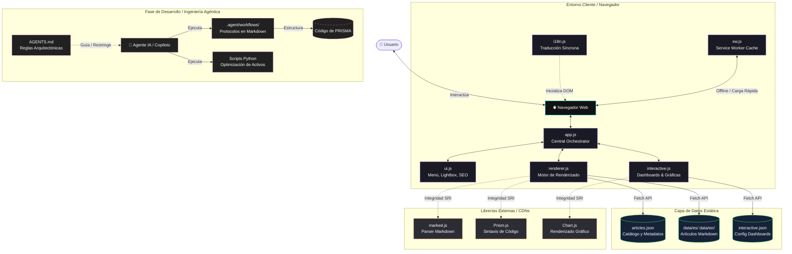
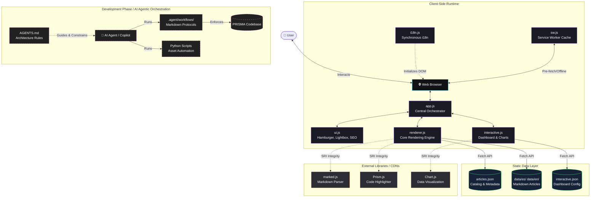

# PRISMA

### [Español](#español) | [English](#english)

---

# Español

<p align="center">
  <a href="https://prisma.alpepaslabs.com" target="_blank">
    
  </a>
</p>

PRISMA es una biblioteca digital de análisis técnicos profundos sobre programación, ciberseguridad e inteligencia artificial, diseñada bajo estándares de **alto rendimiento, modularidad extrema y cero dependencias de construcción**. 

Más allá de ser una plataforma de contenido multiformato, PRISMA ha sido desarrollado como un caso de estudio de **Ingeniería Agéntica (Agentic Engineering)**, demostrando cómo una base de código puede diseñarse específicamente para la colaboración autónoma con Agentes de IA (LLMs) sin perder calidad ni introducir regresiones.

---

## 🎯 Propuesta de Valor e Hitos

**PRISMA** resuelve la complejidad inherente a la visualización y consumo de contenido técnico avanzado en múltiples formatos sin comprometer el rendimiento de carga. En lugar de depender de pesados frameworks modernos de JavaScript que ralentizan el renderizado inicial y aumentan la sobrecarga de configuración, PRISMA demuestra cómo una arquitectura modular pura en Vanilla JS y un diseño desacoplado orientado a datos pueden ofrecer una experiencia de usuario sumamente fluida, interactiva y robusta.

### Hitos del Proyecto:
- **Rendimiento Óptimo (Lighthouse 100/100):** Carga y ejecución instantáneas sin necesidad de bundlers (Webpack, Vite) ni transpiladores.
- **Internacionalización Síncrona Dinámica:** Sistema de traducción i18n síncrono que conmuta el idioma en tiempo real sin recargar la página, conservando fallbacks de SEO estáticos para indexación.
- **Dashboards Interactivos Desacoplados:** Visualizaciones analíticas y calculadoras basadas en Chart.js controladas enteramente por esquemas JSON externos, aislando la lógica UI.
- **Colaboración Agéntica Escalable:** Arquitectura estructurada con límites definidos en [AGENTS.md](AGENTS.md) y flujos automáticos que permiten el mantenimiento y adición de contenido mediante agentes de IA autónomos de forma segura.

---

## 🚀 Características Principales

- **Multi-Formato Embebido:** Cada artículo integra podcasts duales (versiones completas e informativas breves generadas por voz), documentos PDF descargables, infografías técnicas con visor lightbox nativo y dashboards interactivos.
- **Bilingüe (ES/EN) sin Recarga:** Sistema de internacionalización 100% nativo que analiza el DOM y conmuta el idioma en tiempo real sin recargar la página ni usar frameworks.
- **Explorador de Temas Avanzado:** Buscador client-side con lógica booleana *Cualquiera/Todos* (OR/AND) sobre etiquetas auto-generadas desde un catálogo JSON estructurado.
- **Skeleton Screens Nativos:** Contenedores pre-renderizados con shimmers animados para eliminar los flashes de pantalla en blanco durante cargas asíncronas.
- **Arquitectura Modular Vanilla:** Sin frameworks, bundlers ni dependencias de construcción. Basado en módulos ES6 nativos, HTML5 semántico y CSS3 moderno.
- **SEO Estático Fallback:** Meta tags `og:*` y `twitter:*` con valores de fallback reales pre-cargados de forma estática en cada HTML para indexación óptima de rastreadores que no ejecutan JavaScript.
- **Estética "Neon Library":** Interfaz inmersiva en modo oscuro que utiliza variables de CSS HSL y capas tonales de profundidad en lugar de bordes sólidos, siguiendo principios ergonómicos de legibilidad técnica.

---

## 🤖 Ingeniería Agéntica (Agent-Collaborative Design)

Este repositorio está optimizado para demostrar el valor de saber dirigir, restringir y coordinar modelos de lenguaje grandes (LLMs) para generar código limpio, seguro y eficiente:

1. **Restricciones de Arquitectura Deterministas ([AGENTS.md](AGENTS.md)):** Reglas y mapas de dependencias estrictos (`data` ➔ `ui` ➔ `renderer` ➔ `app`) que previenen de forma proactiva que las IA cometan alucinaciones o introduzcan dependencias cíclicas en el navegador.
2. **Workflows como Protocolos de Ejecución (.agent/workflows/):** Guías estructuradas en markdown que actúan como programas que los agentes de IA ejecutan paso a paso, garantizando consistencia en integraciones complejas (como resúmenes editoriales y generación de prompts de NotebookLM).
3. **Pipeline de Activos Híbrido:** Integración de scripts de Python (`generate_branded_squares.py`, `fix_hero_crop_v2.py`) dentro de los workflows de los agentes, permitiendo que la IA manipule, recorte y brandee imágenes y portadas a 3000px de forma matemática y autónoma.
4. **Diseño Desacoplado Orientado a Datos:** Los dashboards interactivos se alimentan de JSONs declarativos (`interactive.json`). Esto permite que un agente de IA diseñe interacciones complejas, gráficas en Chart.js y calculadoras matemáticas sin tocar una sola línea del motor JS central (`interactive.js`).

---

## 🛠️ Stack Tecnológico

El proyecto está diseñado bajo la filosofía **zero-dependency build**, seleccionando tecnologías nativas estables apoyadas por librerías cargadas mediante CDN seguras:

| Tecnología / Herramienta | Rol en el Proyecto | Ventaja Clave |
| :--- | :--- | :--- |
| **HTML5 Semántico** | Estructura base de la aplicación y SEO | Accesibilidad nativa y parsing óptimo para buscadores sin JavaScript. |
| **CSS3 Vanilla** | Diseño responsivo ("Neon Library") | Uso extensivo de variables CSS (`var()`), CSS nesting y layouts Flexbox/Grid sin sobrecarga de frameworks. |
| **JavaScript ES6+** | Lógica de negocio y comportamiento | Módulos nativos (`import`/`export`) cargados bajo demanda por el navegador. |
| **marked.js (CDN)** | Compilador de Markdown a HTML | Conversión ultra rápida de archivos de contenido directamente en el cliente. |
| **Prism.js (CDN)** | Resaltador de sintaxis de código | Estilización de bloques de código en los artículos técnicos con alta velocidad. |
| **Chart.js (CDN)** | Motor de visualización interactiva | Generación de gráficos analíticos en los dashboards a partir de esquemas JSON. |
| **Service Worker** | Cache y PWA básica | Pre-carga selectiva de assets para permitir navegación y accesibilidad offline. |

---

## 📁 Estructura del Proyecto

```
/
├── index.html              # Home: Hero destacable + cronología editorial
├── article.html            # Lector de artículos detallados
├── topics.html             # Buscador interactivo y filtrado de temas
├── interactive.html        # Dashboard analítico e interactivo por artículo
├── robots.txt / sitemap.xml# Configuración SEO y mapa de rastreo
├── sw.js                   # Service Worker para almacenamiento en caché local
│
├── css/
│   └── styles.css          # Diseño Neon Library: variables CSS, layouts y skeletons
│
├── js/
│   ├── app.js              # Orquestador central: inicialización de rutas por data-page
│   ├── data.js             # Capa de datos: fetch con caché en memoria
│   ├── ui.js               # Utilidades de interfaz (Hamburguesa, Lightbox, SEO)
│   ├── renderer.js         # Manipulador del DOM e inyección de plantillas HTML
│   ├── interactive.js      # Controlador de tabuladores, quizzes y calculadoras
│   └── i18n.js             # Traductor síncrono del lado del cliente
│
├── data/
│   ├── articles.json       # Catálogo indexado de metadatos de artículos
│   ├── es/                 # Contenido en Español (Markdowns + JSONs de dashboards)
│   └── en/                 # Contenido en Inglés (Markdowns + JSONs de dashboards)
├── assets/
│   ├── logo.png            # Logo principal (también OG image fallback)
│   ├── covers/             # Héroes panorámicos (3000x1285px) optimizados
│   ├── spotify/            # Portadas de podcast cuadradas con branding automatizado
│   └── sources/            # Activos maestros (logos originales, archivos de diseño)
└── .agent/workflows/       # Protocolos de ejecución para agentes autónomos
```

---

## 🏛️ Arquitectura de JavaScript (Resumen)

El núcleo de lógica de la aplicación se divide en módulos ES6 con responsabilidades únicas:

| Módulo | Responsabilidad |
| :--- | :--- |
| [app.js](js/app.js) | **Orquestador central:** Enruta la ejecución de la página basado en el atributo `data-page` del `<body>`. Bindea eventos que requieren alta interacción DOM. |
| [data.js](js/data.js) | **Capa de Datos pura:** Realiza peticiones a `articles.json` con caché en memoria para una carga instantánea. Resuelve URLs de recursos y formatea fechas. Sin dependencias del DOM. |
| [ui.js](js/ui.js) | **Comportamiento común de UI:** Inicializa el menú hamburguesa, la barra de búsqueda expansiva, el visor de imágenes Lightbox y actualiza dinámicamente las meta-tags de SEO. |
| [renderer.js](js/renderer.js) | **Motor de Renderizado:** Construye e inyecta dinámicamente plantillas HTML (Artículos detallados, listados, relacionados y banners destacados). |
| [interactive.js](js/interactive.js) | **Dashboard interactivo:** Gestiona Chart.js, pestañas (tabs), acordeones, quizzes y calculadoras de costes de infraestructura de IA. |
| [i18n.js](js/i18n.js) | **Traducción Síncrona:** Cargado de forma tradicional (no módulo) para garantizar que `window.i18n` esté disponible antes de la inicialización de los módulos ES6. |

*Para el detalle técnico de interfaces y contratos, consulta [ARCHITECTURE.md](ARCHITECTURE.md).*

---

## 📐 Diagrama de Arquitectura

PRISMA opera de manera 100% autónoma en el navegador del cliente. La interacción entre el usuario, los componentes modulares de JS, los archivos estáticos de datos y la orquestación en tiempo de desarrollo asistido por IA se modela de la siguiente manera:



---

## 🔄 Gestión de Contenido y Workflows

El proceso de creación y despliegue de nuevos artículos técnicos se realiza mediante un flujo de trabajo agéntico estructurado:

1. **Preparación:** Los borradores de Markdowns, PDFs, infografías y demos de dashboards interactivos se colocan en la carpeta `draft/`.
2. **Orquestación:** El agente de IA ejecuta el workflow autónomo [.agent/workflows/article_integration.md](.agent/workflows/article_integration.md).
3. **Automatización:** El agente lee el contenido, calcula el tiempo de lectura, genera metadatos con gancho comercial y los inserta en `articles.json`. Luego, utiliza scripts en Python para optimizar las portadas.
4. **Despliegue y Limpieza:** Se incorporan los URLs finales de plataformas de podcasts (Spotify) y se limpia la carpeta `draft/`.

---

## 📁 Estrategia de Activos

Para asegurar un rendimiento óptimo de carga y escalabilidad, los activos se organizan según su rol:

- **`assets/logo.png` / `favicon.png`:** Logotipos de marca optimizados en peso y resolución.
- **`assets/covers/`:** Imágenes en formato apaisado (3000x1285px) optimizadas para la cabecera web.
- **`assets/spotify/`:** Assets de alta resolución (3000x3000px) con marcos y branding dedicados para agregadores multimedia. *Nota: Debido a su peso, esta carpeta se gestiona bajo Git LFS o almacenamiento en la nube en entornos a gran escala.*
- **`assets/sources/`:** Archivos maestros (logos de diseño originales). Separados de los recursos de ejecución web para optimizar la caché de red.

---

## 💻 Despliegue Local Sencillo

Sigue estos sencillos pasos para clonar y ejecutar el proyecto localmente sin necesidad de instalar dependencias ni herramientas de compilación complejas:

1. **Clonar el repositorio:**
   ```bash
   git clone https://github.com/tu-usuario/prisma.git
   cd prisma
   ```

2. **Iniciar un servidor local (Obligatorio):**
   > [!IMPORTANT]
   > Debido al uso de módulos nativos de ES6, abrir los archivos HTML directamente (`file://`) causará errores de CORS en el navegador. Es obligatorio servir los archivos a través de un servidor HTTP local.
   
   Ejecuta cualquiera de los siguientes comandos en la raíz del proyecto según las herramientas que tengas instaladas en tu sistema:

   ```bash
   # Opción A: Con Node.js (Recomendado)
   npx serve .

   # Opción B: Con Python (Instalado por defecto en la mayoría de sistemas)
   python3 -m http.server 8000

   # Opción C: Con PHP
   php -S localhost:8000
   ```

3. **Acceder a la aplicación:**
   Abre tu navegador web y entra en la dirección indicada por tu servidor (usualmente `http://localhost:3000` para `npx serve` o `http://localhost:8000` para Python/PHP).

---

## 🤖 Desarrollo Asistido por IA (Honestidad Profesional)

> [!NOTE]
> **Declaración de Transparencia:** La arquitectura modular, el sistema de diseño estético "Neon Library", la lógica de negocio modular y el control del estado de esta aplicación han sido ideados y estructurados en su totalidad por mí. Como parte de una práctica moderna y altamente productiva, he utilizado herramientas de Inteligencia Artificial (LLMs) como copilotos avanzados de codificación. 
> 
> La diferencia en este repositorio radica en que **la IA no ha trabajado de forma descontrolada**: se diseñó un entorno de desarrollo estructurado (documentado en [AGENTS.md](AGENTS.md) y los workflows de `.agent/workflows/`) que restringe, guía y audita los cambios realizados por las herramientas autónomas, logrando un código libre de regresiones de diseño, sin dependencias circulares y optimizado de forma determinista.

---
---

# English

<p align="center">
  <a href="https://prisma.alpepaslabs.com" target="_blank">
    
  </a>
</p>

PRISMA is a digital technical library featuring deep analyses of programming, cybersecurity, and artificial intelligence, built with a focus on **high performance, extreme modularity, and zero build tool dependencies**.

In addition to being a multi-format content platform, PRISMA acts as an **Agentic Engineering** case study, proving how a repository's structure and developer experience can be tailored to support safe, high-quality, and autonomous code generation by AI Agents (LLMs).

---

## 🎯 Value Proposition & Milestones

**PRISMA** solves the inherent complexity of serving multi-device technical content without compromising page load speeds. Instead of relying on heavy JavaScript frameworks that delay initial rendering and increase configuration overhead, PRISMA demonstrates how a pure Vanilla JS modular architecture and data-decoupled layout engine can deliver a smooth, interactive, and highly immersive reading experience.

### Key Milestones:
- **Peak Performance (100/100 Lighthouse):** Zero bundlers (webpack/vite) or build tools. Instant rendering with client-side execution.
- **Seamless Synchronous Internationalization:** Client-side i18n translation without page reloads, accompanied by static fallback tags for optimized crawler SEO.
- **Decoupled Interactive Dashboards:** Infrastructure calculators and metrics visualizations powered by Chart.js, managed entirely via external declarative JSON schemas to prevent runtime regressions.
- **Agentic Collaboration Paradigm:** Strict dependency limits and automated guidelines that allow AI Agents to safely contribute to the codebase without introducing regressions or circular imports.

---

## 🚀 Key Features

- **Embedded Multi-Format:** Every technical article is accompanied by dual podcasts (full-length debates and short summaries), downloadable PDFs, infographics with a native lightbox, and interactive analytical dashboards.
- **Client-Side Bilingual UI (ES/EN):** A 100% native localization system that scans the DOM and translates content in real time without reloading the page or pulling in heavy frameworks.
- **Advanced Topic Explorer:** A client-side search engine featuring boolean *Any/All* (OR/AND) filtering logic on auto-generated tags derived from a structured JSON catalog.
- **Native Skeleton Screens:** Shimmer placeholders pre-rendered in HTML structure to eliminate layout shifts or white flashes during async fetches.
- **Vanilla Modular Architecture:** Zero frameworks, bundlers, or compilation build chains. Entirely built on native ES6 modules, semantic HTML5, and modern CSS3.
- **Fallback Static SEO:** `og:*` and `twitter:*` meta tags with real fallback values pre-configured statically in each HTML document for crawlers that do not run JavaScript.
- **"Neon Library" Aesthetics:** A dark UI concept utilizing HSL color variables and tonal elevation layers instead of 1px borders, designed for optimal screen legibility.

---

## 🤖 Agentic Engineering (Agent-Collaborative Design)

This repository highlights the value of prompt engineering, architectural constraints, and LLM-guidance to ensure clean, secure, and robust code:

1. **Deterministic Architecture Rules ([AGENTS.md](AGENTS.md)):** Strict dependency boundary rules (`data` ➔ `ui` ➔ `renderer` ➔ `app`) that proactively prevent AI agents from generating circular imports or introducing layout regressions.
2. **Workflows as Software Protocols (.agent/workflows/):** Structured markdown files that serve as execution state machines for AI agents, guaranteeing absolute consistency during multi-step tasks like content extraction and metadata updates.
3. **Automated Python Asset Pipeline:** Incorporates Python scripts (`generate_branded_squares.py`, `fix_hero_crop_v2.py`) into the agent's workflow, allowing the LLM to autonomously resize, crop, and brand ultra-high-resolution images (3000px+) without human manual intervention.
4. **Data-Driven Dashboard Isolation:** Interactive sections are configured declaratively in local JSON files (`interactive.json`). This ensures that an AI agent can implement complex UI logic, Chart.js views, and custom calculators without editing the core JS engine (`interactive.js`).

---

## 🛠️ Tech Stack

PRISMA is designed under a **zero-dependency build** philosophy, prioritizing native features and optimized utilities loaded from secure CDNs:

| Technology / Tool | Role in Project | Key Benefit |
| :--- | :--- | :--- |
| **Semantic HTML5** | App structure and base SEO | Standard compliance, accessibility, and clean indexing without JS. |
| **Vanilla CSS3** | "Neon Library" responsive design | Custom variables (`var()`), native nesting, and Flexbox/Grid layouts with zero stylesheet size inflation. |
| **ES6+ JavaScript** | Core logical orchestrator | Native modules (`import`/`export`) loaded dynamically by the browser at runtime. |
| **marked.js (CDN)** | Markdown-to-HTML parser | Blazing-fast client-side compile of content files into page containers. |
| **Prism.js (CDN)** | Syntax highlighting engine | Low-overhead code formatting for technical posts. |
| **Chart.js (CDN)** | Analytics dashboard rendering | Client-side visual graph generation dynamically built from JSON structures. |
| **Service Worker** | PWA Caching | Selected background assets pre-fetching for offline reading and speeds. |

---

## 📁 Project Structure

```
/
├── index.html              # Home page: Hero banner + editorial timeline
├── article.html            # Article detail viewer
├── topics.html             # Search page & live tag filter
├── interactive.html        # Analytics and interactive dashboards
├── robots.txt / sitemap.xml# SEO configurations and crawl map
├── sw.js                   # Service worker for local caching
│
├── css/
│   └── styles.css          # Neon Library system: variables, layouts, skeletons
│
├── js/
│   ├── app.js              # Central orchestrator: routing & page inits
│   ├── data.js             # Data access layer with in-memory caching
│   ├── ui.js               # Common UI logic (Hamburger, Lightbox, SEO)
│   ├── renderer.js         # Dynamic DOM writer and HTML templates
│   ├── interactive.js      # Dashboard controller (Charts, quizzes, calculators)
│   └── i18n.js             # Synchronous client-side localization
│
├── data/
│   ├── articles.json       # Main indexed database of article metadata
│   ├── es/                 # Spanish content (Markdowns + dashboard JSONs)
│   └── en/                 # English content (Markdowns + dashboard JSONs)
├── assets/
│   ├── logo.png            # Main logo (also OG image fallback for crawlers)
│   ├── covers/             # Ultra-wide hero covers (3000x1285px)
│   ├── spotify/            # Spotify covers generated via Python automation
│   └── sources/            # Master branding files (original logos, design sources)
└── .agent/workflows/       # Execution protocols for AI agents
```

---

## 🏛️ JavaScript Architecture (Summary)

The core logic of the application is separated into single-responsibility ES6 modules:

| Module | Core Responsibility |
| :--- | :--- |
| [app.js](js/app.js) | **Central orchestrator:** Directs page execution based on the `data-page` attribute on `<body>`. Handles highly-coupled DOM event listeners. |
| [data.js](js/data.js) | **Pure Data Layer:** Fetches and caches `articles.json` data. Resolves asset paths, handles formatting utilities. No DOM dependencies. |
| [ui.js](js/ui.js) | **Shared UI behaviors:** Handles hamburger menu toggle, expandable search bar, lightbox overlays, and dynamic SEO tag updates. |
| [renderer.js](js/renderer.js) | **Rendering Engine:** Dynamically generates and inserts HTML markup templates for article readers, lists, and related grids. |
| [interactive.js](js/interactive.js) | **Interactive Dashboard:** Houses Chart.js configurations, quizzes, accordions, tabs, and infrastructure calculations. |
| [i18n.js](js/i18n.js) | **Synchronous localization:** Traditional script (non-module) that runs first to set `window.i18n` before ES6 modules execute. |

*For complete technical schemas and design contracts, see [ARCHITECTURE.md](ARCHITECTURE.md).*

---

## 📐 Architecture Diagram

PRISMA runs entirely inside the client's browser. The interaction between the user, JavaScript module orchestration, static local data files, CDNs, and development-time AI orchestration is structured as follows:



---

## 🔄 Content Ingestion & Workflows

New content is processed and deployed using a structured agentic workflow:

1. **Staging:** Markdown drafts, PDFs, and HTML dashboard mockups are placed in `draft/`.
2. **Orchestration:** The AI Agent is triggered using the [.agent/workflows/article_integration.md](.agent/workflows/article_integration.md) protocol.
3. **Execution:** The agent parses the markdown files, calculates reading times, generates meta outlines, updates `articles.json`, and triggers Python scripts to compile assets.
4. **Finalization:** Spotify podcast URLs are populated and the `draft/` folder is cleared.

---

## 📁 Asset Strategy

Assets are structured according to their network delivery profiles:

- **`assets/logo.png` / `favicon.png`:** Light weight, high contrast vector-derived raster logos.
- **`assets/covers/`:** Panoramic web header covers (3000x1285px) optimized for core web vitals.
- **`assets/spotify/`:** High-res square covers (3000x3000px) with custom frames for external podcast directories. *(Note: At scale, this directory is managed via Git LFS or external object storage).*
- **`assets/sources/`:** Master branding files (original editable vectors/source PNGs), decoupled from web assets to avoid unnecessary bandwidth.

---

## 💻 Simple Local Setup

Follow these simple steps to clone and run the project locally without having to deal with heavy setup steps or package dependencies:

1. **Clone the repository:**
   ```bash
   git clone https://github.com/your-username/prisma.git
   cd prisma
   ```

2. **Start a local HTTP server (Required):**
   > [!IMPORTANT]
   > Due to native ES6 modules, opening HTML files directly (`file://`) will fail due to CORS. Serving files over a local HTTP server is required.
   
   Run any of the following commands in the root folder depending on your installed toolchain:

   ```bash
   # Option A: With Node.js (Recommended)
   npx serve .

   # Option B: With Python (Pre-installed on most modern OS)
   python3 -m http.server 8000

   # Option C: With PHP
   php -S localhost:8000
   ```

3. **Access the application:**
   Open your browser and navigate to the address output by your server (usually `http://localhost:3000` for `npx serve` or `http://localhost:8000` for Python/PHP).

---

## 🤖 AI-Assisted Development (Professional Honesty)

> [!NOTE]
> **Transparency Declaration:** The architectural design, modular separation of concerns, visual design choices, and business state tracking of this application were fully conceived and designed by me. As part of a modern, high-productivity engineering loop, I leveraged Artificial Intelligence (LLM) agents as advanced code generation copilots.
> 
> The difference in this project is that **AI agency was tightly constrained and controlled**: a custom architectural guideline ([AGENTS.md](AGENTS.md)) and structured workflows (`.agent/workflows/`) were put in place to restrict, direct, and audit all automated code edits. This guarantees zero circular dependency crashes and maintains design consistency without manual human overhead.
